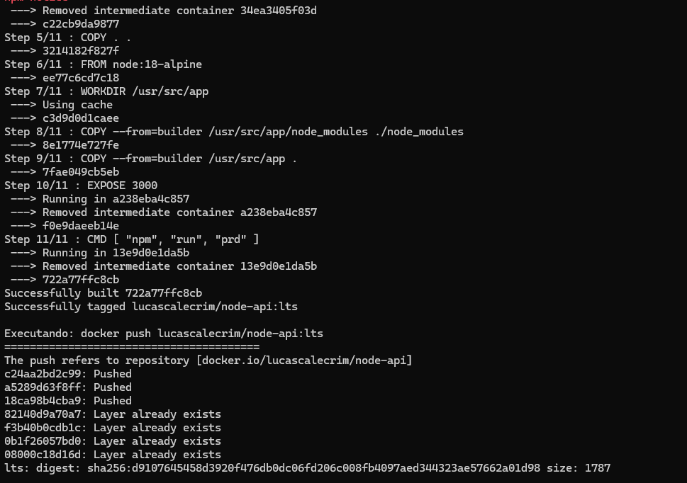

# **Projeto Node.js com PostgreSQL e Kubernetes**

Este projeto é uma aplicação de API Node.js utilizando JavaScript e um banco de dados PostgreSQL, orquestrados com Kubernetes e automatizados com Ansible. O processo atual foca na inicialização e no "seeding" do banco de dados, sem a funcionalidade de CRUD Via API.

## **1\. Tecnologias**

* **Node.js**: Ambiente de execução da API.  
* **PostgreSQL**: Banco de dados relacional.  
* **Docker**: Criação e gestão de contêineres.  
* **Kubernetes**: Orquestração e gerenciamento dos contêineres.  
* **Minikube**: Ferramenta para criar um cluster Kubernetes local.  
* **Ansible**: Automação do processo de implantação.

## **2\. Estrutura da Aplicação**

* **`src/`**: Contém o código-fonte da aplicação Node.js.  
  * `models/sql/UserRepository.js`: Lógica para interagir com o PostgreSQL e popular a tabela de usuários.  
  * `services/UserService.js`: Lógica de negócio, como o registro de usuários.  
  * `add-users.js`: Script para popular o banco de dados com dados iniciais.  
* **`config/`**: Arquivos de configuração.  
* **`.env`**: Variáveis de ambiente sensíveis.  
* **`k8s/`**: Manifestos do Kubernetes para implantação.  
* **`ansible/`**: Playbooks do Ansible para automação.  
* **`run_all.py`**: Script para automatizar a implantação completa.

## **3\. Manifestos do Kubernetes (`k8s/`)**

Os arquivos YAML na pasta `k8s/` definem como os componentes da sua aplicação (banco de dados e API) serão executados no cluster Kubernetes.

* **`app-deployment.yml`**: Cria um **Deployment** que gerencia a API Node.js. Ele garante uma réplica do pod e define a imagem Docker e as variáveis de ambiente necessárias.  
* **`app-service.yml`**: Define um **Service** do tipo `NodePort` que expõe a API na porta `30000` do nó, tornando-a acessível externamente.  
* **`db-deployment.yml`**: Cria um **Deployment** para o banco de dados PostgreSQL, definindo a imagem, as variáveis de ambiente e um `PersistentVolumeClaim` para garantir a persistência dos dados.  
* **`db-service.yml`**: Define um **Service** para o banco de dados, permitindo que a API se conecte a ele dentro do cluster.  
* **`init-db.yml`**: Cria um **Pod** de inicialização com uma política de reinício `OnFailure`. Este pod aguarda o banco de dados e executa o comando `psql` para criar a tabela de `users`.

## **4\. Automação com Ansible**

O Ansible é usado para automatizar o processo de implantação com "playbooks".

* **`ansible/provisionamento.yml`**: Este playbook aplica os manifestos do Kubernetes na ordem correta: primeiro o banco de dados e seu serviço, depois o pod de inicialização e, por fim, a API e seu serviço.  
* **`ansible/build-and-push.yml`**: Este playbook é responsável por construir a imagem Docker da sua aplicação e enviá-la para um registro de contêiner.

## **5\. Como Fazer Tudo Funcionar?**

Para iniciar o projeto do zero, basta executar os scripts de automação.

### **Instalação dos Requisitos**

Para instalar todas as dependências necessárias, execute o script `install_all.py` na raiz do projeto.

- **Instala todas as dependências e ferramentas**  
- **Necessita do Python 3 e do pip instalados.**
```py
import subprocess

commands \= \[  
    # Instala pacotes essenciais  
    "sudo apt install \-y docker.io ansible conntrack kubectl "  
    "qemu-kvm libvirt-daemon-system libvirt-clients virt-manager bridge-utils "  
    "curl wget apt-transport-https ca-certificates software-properties-common",

    # Instala Minikube  
    "curl \-LO \[https://storage.googleapis.com/minikube/releases/latest/minikube-linux-amd64\](https://storage.googleapis.com/minikube/releases/latest/minikube-linux-amd64)",  
    "sudo install minikube-linux-amd64 /usr/local/bin/minikube",  
    "rm minikube-linux-amd64",

    # Adiciona o usuário ao grupo docker para evitar 'sudo'  
    "sudo usermod \-aG docker $USER"  
\]

for cmd in commands:  
    print(f"\\nExecutando: {cmd}\\n{'='\*40}")  
    subprocess.run(cmd, shell=True)
 
subprocess.run(\["pip", "install", "kubernetes", "openshift", "docker"\])  
subprocess.run(\["ansible-galaxy", "collection", "install", "community.general"\])
```
### **Execução Automática**

Para construir, implantar e iniciar tudo, basta executar o script `run_all.py` que vai cuidar de todos os processos em sequência.

# Script para gerenciar a implantação  
```py
import subprocess

commands \= \[  
    "minikube delete \--all",  
    "docker system prune \-a \--volumes \-f",  
    "docker build \-t lucascalecrim/node-api:lts .",  
    "docker push lucascalecrim/node-api:lts",  
    "ansible-playbook \-i ansible/hosts.ini ansible/build-and-push.yml",  
    "minikube start \--driver=kvm2",  
    "kubectl create configmap node-api-env \--from-file=.env \--dry-run=client \-o yaml | kubectl apply \-f \-",  
    "kubectl apply \-f k8s/",  
    "minikube status",  
    "watch \-n 1 kubectl get pods"  
\]

for cmd in commands:  
    print(f"\\nExecutando: {cmd}\\n{'='\*40}")  
    result \= subprocess.run(cmd, shell=True)  
    if result.returncode \!= 0:  
        print(f"Erro ao executar: {cmd}")  
        break
```
# Alimentação do banco via js 

Apos verificar tudo corretamente é importante verifica os ips dos serviços 
com

```bash
minikube service list
minikube service postgres-service --url
```


È valido ressaltar o pol ela é de acordo com o ip do do serviço do postgres
então é de extrema importancia colocar esse ip para seed no 
```bash
[Os testes estão na raiz do projeto]
nodejs test-connection.js
nodejs test-postgres.js

[O seed e a busca estão em /src]
nodejs add-user.js
node query.js
```
- o que precisa ser alterado de acordo com o ip são essas informações de todos os scripts acima
**A depender do ip e porta**

```js
const pool = new Pool({
        host: '192.168.61.216', //Aqui para o ip do postgres 
        port: 31748, // aqui para a porta
        user: 'postgres',
        password: 'admin', 
        database: 'api-db',
    });
```

# Teste de conexão e integração com o Postgres
- os testes podem ser executado na raiz do projeto em 
**nodejs test-connection.js**
**nodejs test-postgres.js**


# Projeto Funcionando, minikube e conexão com postgres
- Deletando minikube antigo e zerando cache para confirmar a criação de um novo (está no script)


### Docker
- confirmando a criação do docker com **docker build -t lucascalecrim/node-api:lts** 
- dando push na imagem lts com **docker push lucascalecrim/node-api:lts**




### Ansible e Minikube
- Ansible PLaybook **ansible-playbook -i ansible/hosts.ini ansible/build-and-push.yml**
- Startando Minikube com Driver especifico **minikube start --driver=kvm2**


### Minikube rodando 


### Seed com o o postgres (Alimentação e busca avançada)


